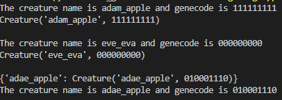
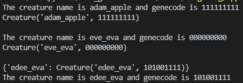

English | [繁體中文](README_TCH.md)
# Code_Genetic_Creature
A project try to experiment the gene code or code DNA in program.

# Prototype
It will declare two creature has first name, last name, genecode, and child.

Two creature will try to make two creature breed new child.

## Sample

## Wait to update
- [ ] name pool
